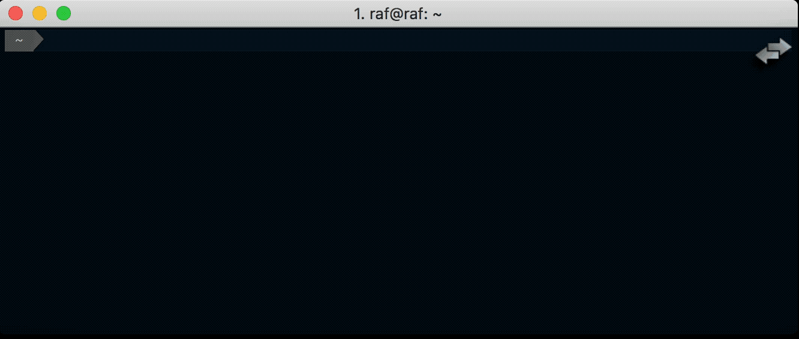
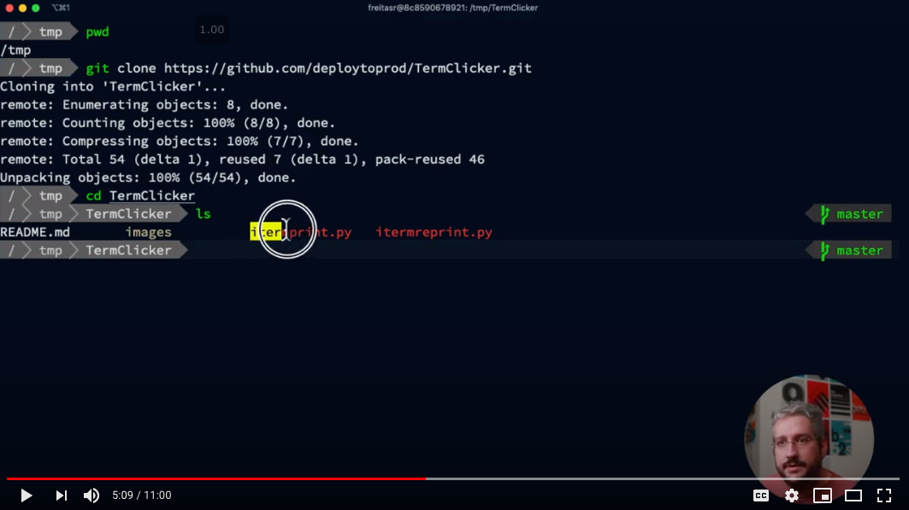
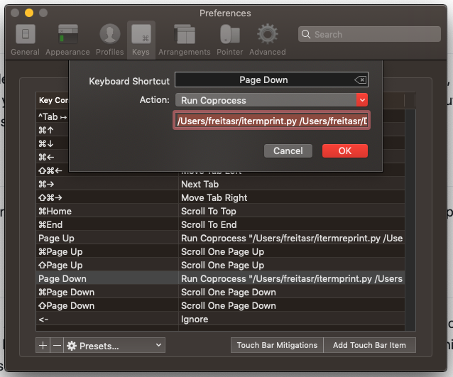

# TermClicker

No more copy/pasting commands when you are delivering demos to your audience, this can lead to human mistakes, typos, confusion and undesirable stuff you don't want in your demo session. *TermClicker* loads commands from a text file and inputs them into your terminal, line by line, every time you press your clicker button. It is not a Terminal simulator.

## Requirements

*TermClicker* requires you to use [iTerm] or any other Terminal application that supports running co-processes whenever you press a key on your keyboard.

## Configuration

### How-To Video

I found easier to create a video showing how to configure, here it is:

If are grumpy and do not like videos, find text instructions below.

Clone the repository into a folder, open your [iTerm] App, go to Preferences > Keys, add a new Keymapping like the image below, specifying the `itermprint.py` location followed by your commands file. We usually assign the *Page Down* key because this is the key that clickers passes to the OS when you press the forward button.

`/Users/freitasr/itermprint.py <commandsfile>`

### The commands file

The desired commands should be specified in a text file and you should break them into separate lines. The first line of this file must contain the index, which is an integer that corresponds to the first command execution, every time you invoke the app, it gets the command specified on that line, prints it and increments that integer for the next execution. It is that simple. We usually start with the index `1` when we want to start a presentation.

`itermreprint.py` does almost the same thing, but uses the command specified on the line above what is defined on the index and doesn't increment when it finishes printing. Ideal to use when you want to replay the last command.

`^^^^` at the end of a command line tells TermClicker to ignore the rest of the line - including the new line. This is useful when you don't want TermClick to "press enter" for you at the end of a command.  Also handy for commenting your commandfile!

## Caveats and observations

Since the commands will be executed in a non-interactive way, make sure that everything you want to input on your CLI demo is predicted in your commands file. i.e. when you SSH an instance for the first time, you have to accept the RSA key typing `yes`, remember to put that `yes` on your commands list.

[iTerm]: https://www.iterm2.com/
